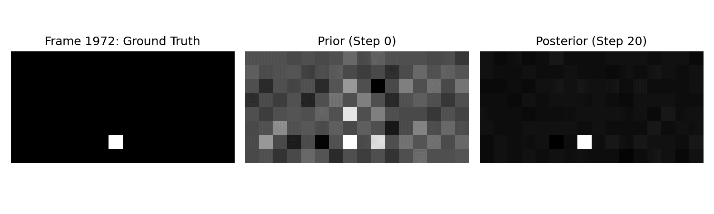
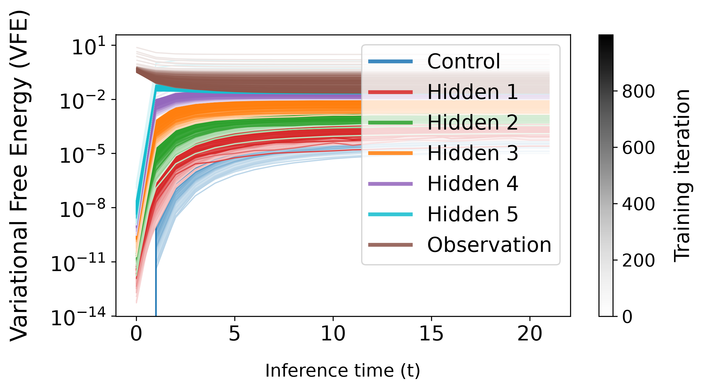

<p align="center">
  
</p>
<h1 align="center">pc-nox: Deep and Temporal Predictive Coding</h1>

This library aims to provide easy to use [Equinox](https://github.com/patrick-kidger/equinox) ([JAX](https://github.com/jax-ml/jax)) implementations of cutting edge Predictive Coding (PC) variants, and experimental fusion architectures, with an emphasis on deep and temporal models. Development is done with the goal of supporting modular functionality within larger continual learning meta-architectures.


## Currently Supported Architectures

* **tPC-H ([Ng-Kee-Kwong et al., 2026](https://www.biorxiv.org/content/10.64898/2026.07.09.737423v1))**: Hierarchical temporal Predictive Coding, with any number of hidden layers, of any size.


## Other Features

* **Flexible Inference & Training Modes**: Supports both fast, fixed-iteration execution fused via jax.lax.scan and adaptive ODE solving via [Diffrax](https://github.com/patrick-kidger/diffrax) - configurable step-by-step or chunk-by-chunk.
* **Model Management**: Comprehensive save/load methods, supporting seamless training resumption irrespective of model type or training environment.
* **Visual Prediction Plotting**: Compare ground truth to pre- and post-inference predictions in visual environments, with the option to save frames and video. 
* **VFE Plotting**: Clear and configurable layerwise energy graphs.
* **PyHGF Compatability**: Version matches [pyHGF](https://github.com/ComputationalPsychiatry/pyhgf) (0.3.2) shared dependencies for cross compatibility. Compatibility will be maintained.


| Visual Predictions Plotting | Energy Graph |
| :---: | :---: |
|  |  |


## Planned Architectures

* **tPC-E ([Ng-Kee-Kwong et al., 2026](https://www.biorxiv.org/content/10.64898/2026.07.09.737423v1))**: Temporal Predictive Coding with eligibility traces.
* **PCN-HEP ([Mohammadi & Ororbia, 2026](https://arxiv.org/abs/2606.22744))**: PCN with Highway Error Propagation.
* **Meta-PCN ([Ha et al., 2026](https://openreview.net/forum?id=kE5jJUHl9i))**: PCN with meta-prediction errors and weight regularization.


## Installation

```
# Clone repo
git clone https://github.com/PerfectPickle/pc-nox
cd pc-nox

# Create and activate a Python 3.12 environment
conda create -n pc-nox python=3.12 -y
conda activate pc-nox

# Install the package locally
pip install .

# For CUDA (e.g. 12) usage, upgrade JAX
pip install "jax[cuda12]>=0.4.38,<0.7" "jaxlib>=0.4.38,<0.7" "numpy>=2.0,<2.5" --force-reinstall
```


## See Also

* **[JPC](https://github.com/thebuckleylab/jpc)**: A JAX predictive coding library, supporting many other developments not covered by pc-nox, such as bidirectional PC, ePC, and more.
* **[pyHGF](https://github.com/ComputationalPsychiatry/pyhgf)**: Rich, modular framework for a variety of networks such as the generalised Hierarchical Gaussian Filter.


## References

1. **Kidger, P., & Garcia, C. (2021).** *Equinox: Neural networks in JAX via callable PyTrees and filtered transformations*. arXiv. https://doi.org/10.48550/arXiv.2111.00254
2. **Bradbury, J., Frostig, R., Hawkins, P., Johnson, M. J., Katariya, Y., Leary, C., Maclaurin, D., Necula, G., Paszke, A., VanderPlas, J., Wanderman-Milne, S., & Zhang, Q. (2018).** *JAX: Composable transformations of Python+NumPy programs* (Version 0.3.13) [Computer software]. GitHub. http://github.com/jax-ml/jax
3. **Ng-Kee-Kwong, J., Tang, M., Akam, T., & Bogacz, R. (2026).** *Learning complex temporal dependencies via local synaptic plasticity*. bioRxiv. https://doi.org/10.64898/2026.07.09.737423
4. **PyHGF Development Team. (2026).** *PyHGF: A neural network library for predictive coding* (Version as of August 2026) [Computer software]. GitHub. https://github.com/ComputationalPsychiatry/pyhgf
5. **Mohammadi, A., & Ororbia, A. G. (2026).** *Error highways: Scaling predictive coding to very deep networks*. arXiv. https://doi.org/10.48550/arXiv.2606.22744
6. **Ha, M. H., Kim, H., Sung, Y., Jo, Y., Kang, M. S., & Lee, S. W. (2026).** *Stable and scalable deep predictive coding networks with meta-prediction errors*. International Conference on Learning Representations (ICLR 2026). OpenReview. https://openreview.net/forum?id=kE5jJUHl9i